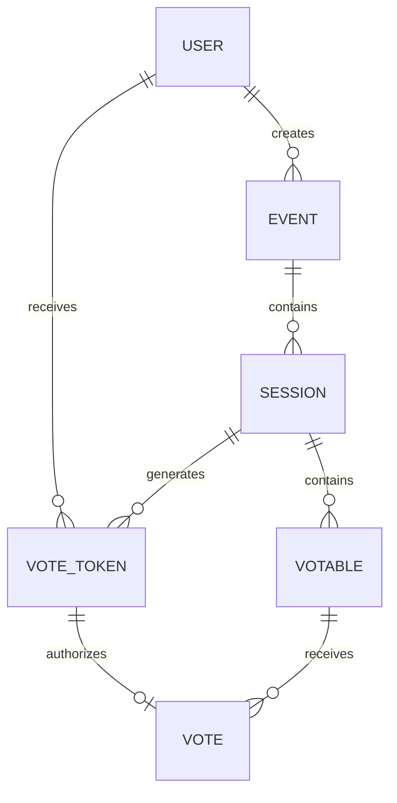

# Project Plan: Evote - General-Purpose Voting Application

## 1. Project Overview

### 1.1 Vision Statement

Evote is a flexible, general-purpose voting application designed to facilitate organizational elections and other voting events. The platform aims to provide a secure, user-friendly experience for creating, managing, and participating in various types of voting sessions, with powerful analytics capabilities.

### 1.2 Project Goals

1. Create a reusable, general-purpose voting platform
2. Initially focus on organizational elections
3. Ensure data integrity and authenticity
4. Support various voting methods and configurations
5. Provide insightful analytics and visualization
6. Implement using Test-Driven Development (TDD) methodology

## 2. System Architecture

### 2.1 Current Architecture

- **Frontend**: Nuxt.js 3 application
- **Backend/Database**: Firebase (Firestore)
- **Authentication**: Firebase Authentication
- **State Management**: TanStack Query

### 2.2 Potential Future Architecture

- **Frontend**: Maintain Nuxt.js 3
- **Backend/Database**: Consider migration to PostgreSQL with DrizzleORM
- **Hosting**: Consider Neon database for PostgreSQL hosting and scalability
- **Analytics**: Integration with PostHog for user monitoring and advanced analytics

## 3. Domain Model

### 3.1 Core Entities

#### Event
- The top-level container for a voting activity
- Contains one or more sessions
- Properties:
  - ID
  - Title
  - Description
  - Creator (User ID)
  - Creation Date
  - Status (Draft, Active, Completed, Archived)
  - Settings (Privacy, Access Control)

#### Session
- A specific voting instance within an event
- Properties:
  - ID
  - Title
  - URL (for direct access)
  - Event ID
  - Start Time
  - End Time
  - Status (Upcoming, Active, Closed)
  - Settings (Voting Method, Anonymity)

#### Votable
- An item that can be voted on within a session
- Properties:
  - ID
  - Title
  - Subtitle (optional)
  - Description (optional)
  - Number/Position
  - Session ID
  - Media (optional - images, documents)

#### User
- A person who interacts with the system
- Properties:
  - ID
  - Display Name
  - Email
  - Roles (per event)

#### Vote Token
- A unique token that authorizes a user to vote in a specific session
- Properties:
  - Token (unique identifier)
  - User ID
  - Session ID
  - Creation Date
  - Expiration Date
  - Used Status (boolean)

#### Vote
- A record of a user's voting action
- Properties:
  - ID
  - Vote Token ID
  - Votable ID
  - Timestamp
  - Value (depends on voting method)

### 3.2 Relationships



## 4. Feature Requirements

### 4.1 Core Features

#### User Management
- [x] User authentication via Google (currently implemented)
- [ ] User profile management
- [ ] Role-based access control (Admin, Voter)
- [ ] User invitation system

#### Event Management
- [ ] Create, edit, and delete events
- [ ] Manage event settings and privacy
- [ ] Event dashboard with overview statistics
- [ ] Event templates for quick setup

#### Session Management
- [x] Basic session creation (currently implemented)
- [ ] Session scheduling (start/end times)
- [ ] Session types configuration
- [ ] Real-time session monitoring

#### Voting System
- [ ] Multiple voting methods:
  - [ ] Single choice
  - [ ] Multiple choice
  - [ ] Ranked choice
- [ ] Vote token generation and management
- [ ] Vote verification and validation
- [ ] Anonymous voting option

#### Results and Analytics
- [ ] Real-time results display
- [ ] Results visualization (charts, graphs)
- [ ] Export results in various formats
- [ ] Integration with PostHog for advanced analytics

#### Notifications
- [ ] Email notifications for:
  - [ ] Event invitations
  - [ ] Session reminders
  - [ ] Results availability

### 4.2 Future Enhancements

- [ ] Custom branding options for organizations
- [ ] API for third-party integrations
- [ ] Mobile application
- [ ] Advanced security features (2FA, audit logs)
- [ ] Internationalization and localization

## 5. Technical Implementation Plan

### 5.1 Development Approach

The project will follow Test-Driven Development (TDD) methodology:

1. Write tests that define the expected behavior
2. Implement the minimal code to pass the tests
3. Refactor the code while maintaining test coverage
4. Repeat for each feature

### 5.2 Testing Strategy

#### Unit Tests
- Entity validation
- Business logic functions
- Utility functions

#### Integration Tests
- API endpoints
- Query functions
- Service interactions

#### End-to-End Tests
- User flows
- Critical paths

### 5.3 Implementation Phases

#### Phase 1: Foundation
- Set up testing infrastructure
- Define core entities and relationships
- Implement basic authentication and session management

#### Phase 2: Voting System
- Implement vote token generation and validation
- Develop voting mechanisms for different methods
- Create vote recording and verification system

#### Phase 3: Event Management
- Develop event creation and management
- Implement session configuration within events
- Create user invitation and role management

#### Phase 4: Analytics and Reporting
- Implement basic results visualization
- Integrate with PostHog for advanced analytics
- Develop export functionality

#### Phase 5: Notifications and Enhancements
- Add email notification system
- Implement additional security features
- Develop customization options

## 6. Database Schema

### 6.1 Current Firestore Collections

- `users`: User profiles
- `sessions`: Voting sessions
- `votables`: Items that can be voted on
- `vote-tokens`: Authorization tokens for voting
- `votes`: Records of cast votes

### 6.2 Proposed Schema Extensions

- `events`: Top-level container for sessions
- `invitations`: User invitations to events
- `roles`: User roles within events
- `templates`: Reusable event templates

## 7. User Interface Design

### 7.1 Key Screens

- Landing page
- User dashboard
- Event creation/management
- Session configuration
- Voting interface
- Results dashboard
- Admin monitoring interface

### 7.2 Design Principles

- Clean, intuitive interface
- Responsive design for all devices
- Accessible to all users
- Consistent visual language
- Data-focused visualizations

## 8. Security Considerations

### 8.1 Data Integrity

- Ensure votes cannot be tampered with
- Implement validation at all levels
- Use transaction-based operations for critical actions

### 8.2 Authentication and Authorization

- Secure user authentication
- Role-based access control
- Session-based authorization

### 8.3 Privacy

- Option for anonymous voting
- Data minimization principles
- Clear privacy policies

## 9. Performance and Scalability

### 9.1 Current Requirements

- Support for up to 100 concurrent users
- Responsive experience for all users

### 9.2 Future Scalability

- Consider migration to PostgreSQL with DrizzleORM
- Implement caching strategies
- Optimize for larger user bases

## 10. TDD Implementation Strategy

### 10.1 Setting Up the Testing Environment

```bash
# Install testing dependencies
npm install -D vitest @vitejs/plugin-vue @nuxt/test-utils happy-dom
npm install -D @vue/test-utils @testing-library/vue
```

### 10.2 Test Directory Structure

```
app/
├── test/
│   ├── unit/
│   │   ├── entities/
│   │   ├── services/
│   │   └── utils/
│   ├── integration/
│   │   ├── api/
│   │   └── queries/
│   ├── e2e/
│   ├── mocks/
│   └── helpers/
```

### 10.3 TDD Workflow

1. Identify a feature or requirement
2. Write a failing test that defines the expected behavior
3. Implement the minimal code to make the test pass
4. Refactor the code while keeping tests passing
5. Move to the next feature

### 10.4 Mocking Strategy

- Create mock implementations of Firebase services
- Use dependency injection for testability
- Implement test helpers for common operations

## 11. Development Roadmap

### 11.1 Initial Setup (Current Status)

- [x] Basic Nuxt.js application
- [x] Firebase integration
- [x] User authentication
- [x] Basic session management

### 11.2 Next Steps

1. Set up testing infrastructure
2. Implement vote token system
3. Develop voting mechanisms
4. Create event management
5. Implement analytics integration

### 11.3 Long-term Vision

- Complete general-purpose voting platform
- Analytics-driven insights
- Potential migration to PostgreSQL
- Mobile application development

## 12. Conclusion

This project plan outlines the development of Evote, a general-purpose voting application with an initial focus on organizational elections. By following Test-Driven Development principles, the project aims to create a robust, maintainable application that can evolve to meet various voting needs.

The plan emphasizes a phased approach, starting with core functionality and gradually adding features while maintaining high code quality through comprehensive testing. The flexible architecture allows for future enhancements and potential migration to different database technologies as the application scales.
